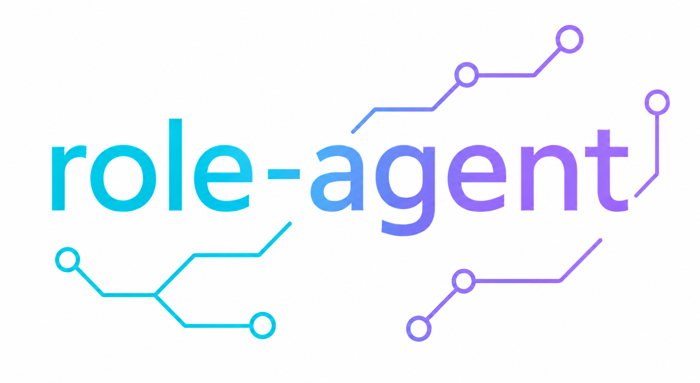

<p align="center">
  
</p>

# Role-Agent

Role-Agent is a training extension for LLM agents built on top of
[`verl-agent`](https://github.com/langfengQ/verl-agent) and
[`veRL`](https://github.com/volcengine/verl). This repository keeps the
multi-turn rollout, environment, and RL training stack from `verl-agent`, and
adds Role-Agent style dual-role evolution for agent training.

The core additions are:

- **World-In-Agent (WIA):** the agent can predict the next world feedback with
  a `<predict_next>` field, and rollout rewards are shaped by similarity
  between the prediction and the next observation.
- **Agent-In-World (AIW):** failed episodes are summarized as lightweight
  failure fingerprints; similar tasks are sampled more often through a mutable
  weighted curriculum.
- **Integrated training hooks:** WIA and AIW are controlled through
  `algorithm.role_agent.*` Hydra flags and work with the existing PPO/GiGPO
  multi-turn rollout pipeline.
- **Ready-to-run scripts:** launch examples for ALFWorld, WebShop, Search-R1,
  and WebShop + GiGPO live under `examples/role_agent_trainer/`.

For implementation details and design tradeoffs, see
[`docs/role_agent_alignment.md`](./docs/role_agent_alignment.md).

## Repository Layout

| Path | Purpose |
| --- | --- |
| `role_agent/` | WIA scoring utilities, AIW curriculum, and optional prompt templates |
| `agent_system/multi_turn_rollout/` | Multi-turn rollout loop with Role-Agent reward hooks |
| `verl/trainer/ppo/ray_trainer.py` | PPO/GiGPO trainer integration for AIW sampling updates |
| `examples/role_agent_trainer/` | Role-Agent launch scripts |
| `docs/role_agent_alignment.md` | Detailed WIA/AIW behavior and config notes |

## Quick Start

Install dependencies following the upstream `verl-agent`/`veRL` environment
requirements, then run one of the Role-Agent examples:

```bash
cd /path/to/roleagent
bash examples/role_agent_trainer/run_webshop.sh
```

Enable or disable the two Role-Agent components through Hydra:

```bash
algorithm.role_agent.enable_wia=true \
algorithm.role_agent.enable_aiw=true
```

Useful Role-Agent options in `verl/trainer/config/ppo_trainer.yaml` include:

- `algorithm.role_agent.text_match_max_chars`
- `algorithm.role_agent.aiw_top_k`
- `algorithm.role_agent.aiw_boost`
- `algorithm.role_agent.aiw_self_boost`
- `algorithm.role_agent.aiw_similarity_thresh`
- `algorithm.role_agent.aiw_max_history`

When AIW is enabled, use `data.dataloader_num_workers=0` so the mutable
weighted sampler remains well-defined.

## Example Scripts

| Script | Environment | Algorithm |
| --- | --- | --- |
| `examples/role_agent_trainer/run_alfworld.sh` | ALFWorld | PPO / GAE |
| `examples/role_agent_trainer/run_webshop.sh` | WebShop | PPO / GAE |
| `examples/role_agent_trainer/run_webshop_gigpo.sh` | WebShop | GiGPO |
| `examples/role_agent_trainer/run_search.sh` | Search-R1 | GiGPO |

Data roots can be overridden with the environment variables documented in
[`examples/role_agent_trainer/README.md`](./examples/role_agent_trainer/README.md).

## Upstream Base

This project is derived from `verl-agent`, which provides the scalable
step-independent multi-turn rollout design, supported environments, and RL
algorithm implementations such as PPO, GRPO, DAPO, RLOO, and GiGPO. Role-Agent
focuses on the WIA/AIW training additions on top of that base.

Please also cite or acknowledge the upstream projects when using this code:

- [`verl-agent`](https://github.com/langfengQ/verl-agent)
- [`veRL`](https://github.com/volcengine/verl)

## License

This repository follows the upstream Apache-2.0 license. See
[`LICENSE`](./LICENSE).
